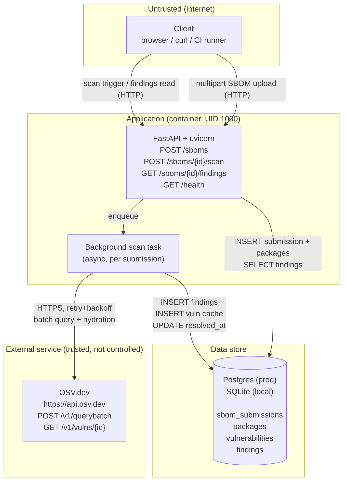
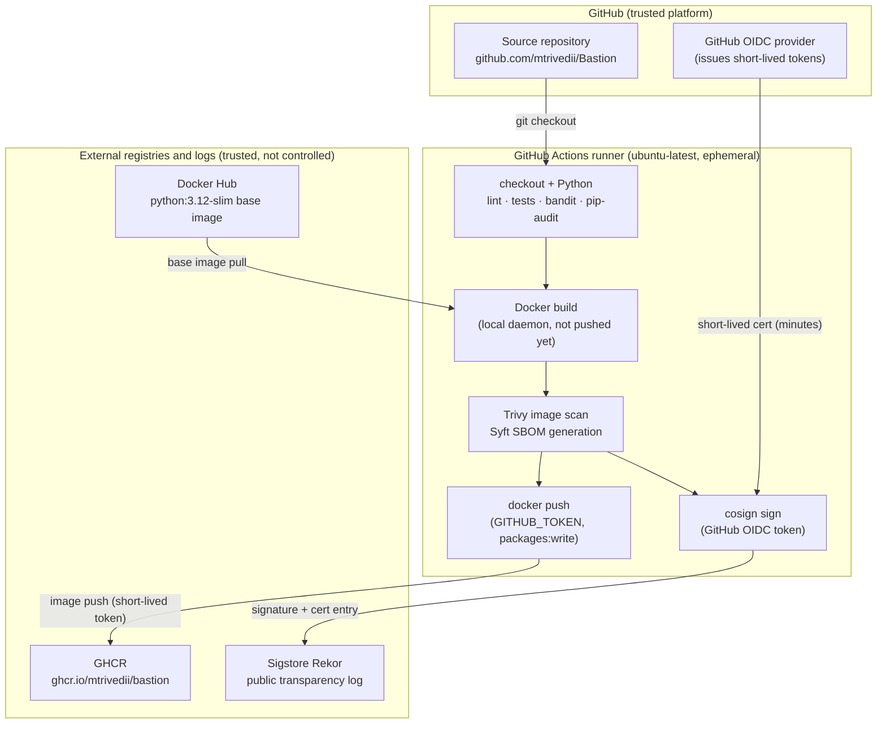

# Threat Model: Drydock Dependency Watchdog

**Method:** STRIDE  
**Date:** July 2026  
**Author:** mtrivedii  
**Revision:** 1 — initial, Phase 1 scope only

---

## Table of contents

1. [Scope and assumptions](#1-scope-and-assumptions)
2. [Data flow diagram](#2-data-flow-diagram)
3. [Assets worth protecting](#3-assets-worth-protecting)
4. [Trust boundaries](#4-trust-boundaries)
5. [STRIDE analysis](#5-stride-analysis)
   - [Spoofing](#spoofing)
   - [Tampering](#tampering)
   - [Repudiation](#repudiation)
   - [Information disclosure](#information-disclosure)
   - [Denial of service](#denial-of-service)
   - [Elevation of privilege](#elevation-of-privilege)
6. [Summary table](#6-summary-table)
7. [What is not modeled here, and why](#7-what-is-not-modeled-here-and-why)

---

## 1. Scope and assumptions

### What is in scope

**The application:**
- The four FastAPI endpoints: `POST /sboms` (upload), `POST /sboms/{id}/scan` (trigger),
  `GET /sboms/{id}/findings` (report), `GET /health`
- The Postgres database (production target) and SQLite fallback (local dev)
- The OSV.dev HTTP integration in `app/osv_client.py`: batch queries, vulnerability hydration,
  local caching in the `vulnerabilities` table, retry/backoff logic
- The background scan task (`app/services/scan.py`) and finding-resolution logic

**The CI/CD pipeline:**
- GitHub Actions workflow (`.github/workflows/ci.yml`)
- All ten stages: ruff lint, pytest, Bandit, pip-audit, Docker build, Trivy image scan,
  Syft SBOM generation, GHCR login, image push, Cosign keyless signing
- The container image itself and what it contains (multi-stage Dockerfile)

### What is explicitly out of scope

**AWS, EKS, Terraform, Kubernetes, Helm, Kyverno, ArgoCD, Prometheus/Grafana** -- none of
this infrastructure exists yet. Phases 2 and 3 build it. Modeling infrastructure that hasn't
been built would be guessing at attack surfaces that don't yet exist, not threat modeling.

This document should be revisited, extended, and re-issued when Phase 3 (EKS deployment)
is complete. At that point the trust boundaries change significantly: there is a real network
perimeter, a real ingress, real pod-to-pod communication, and real IAM roles to model.

### Assumptions

- The app runs as a single-user portfolio demonstration, not a multi-tenant production
  service. There are no real end users beyond the developer. This affects the severity
  rating of several threats -- gaps that would be critical in a SaaS product are accepted
  risks here because the exposure is controlled and the data is not sensitive.
- The GitHub repository is private or public-but-reviewed by one person. There are no
  external contributors with commit access.
- OSV.dev is treated as a trusted external service. We rely on its data being accurate.
  We do not verify that OSV.dev itself has not been compromised.

---

## 2. Data flow diagram

Two separate flows are shown: the application at runtime, and the CI/CD pipeline.
Trust boundaries are marked with subgraph labels.

### Application data flow



### CI/CD pipeline data flow



---

## 3. Assets worth protecting

| Asset | Where it lives | Why it matters |
|-------|---------------|----------------|
| SBOM submission data | `sbom_submissions` + `packages` tables | Contains a list of every dependency in a scanned project. In a real deployment, this is a roadmap of what's installed -- valuable to an attacker looking for exploitable packages. |
| Vulnerability findings | `findings` + `vulnerabilities` tables | A record of which packages have known CVEs and when they were found/resolved. If tampered with, the app reports false negatives and vulns go unaddressed. |
| OSV.dev response integrity | In-flight (HTTPS) + `vulnerabilities` cache | If an attacker can poison the OSV.dev response or the local cache, they can suppress real findings or inject false ones. |
| `GITHUB_TOKEN` (packages:write) | GitHub Actions runtime environment | The short-lived token that authorizes image pushes to GHCR. If stolen during a CI run, an attacker can push arbitrary images to the project's registry namespace. |
| GitHub OIDC token (id-token:write) | GitHub Actions runtime environment | The short-lived token that cosign uses to obtain a signing certificate from Sigstore/Fulcio. If stolen, an attacker can sign arbitrary artifacts under this repo's identity in Rekor. |
| The container image in GHCR | `ghcr.io/mtrivedii/bastion:<sha>` | What gets deployed. A tampered image in GHCR that passes Cosign verification would be trusted by Phase 2's Kyverno policy. |
| The CI pipeline definition | `.github/workflows/ci.yml` | Controls what security gates run and what gets deployed. Bypassing or modifying it is equivalent to bypassing all the security controls it enforces. |

---

## 4. Trust boundaries

| Boundary | Who crosses it | What crosses it | Current control |
|----------|---------------|-----------------|-----------------|
| Internet -> App | Unauthenticated client | SBOM files (user-supplied), scan triggers, findings requests | None. No auth, no TLS on the app itself. |
| App -> Postgres | The app process (UID 1000) | SQL queries via SQLAlchemy ORM | `DATABASE_URL` env var with credentials. Parameterized queries prevent injection. |
| App -> OSV.dev | The background scan task | Package name/version/ecosystem data outbound; CVE IDs and details inbound | HTTPS with default TLS verification (`httpx` default). Retry/backoff on transient failures. |
| CI runner -> Docker Hub | GitHub Actions runner | `python:3.12-slim` base image pull | Unauthenticated pull. Image digest is not pinned (future improvement). |
| CI runner -> GHCR | GitHub Actions runner | Container image push | Short-lived `GITHUB_TOKEN` (expires at run end). No stored long-lived credentials. |
| CI runner -> Sigstore | GitHub Actions runner | Signing certificate request (OIDC token outbound), signature entry (inbound) | GitHub OIDC token proves runner identity. Certificate valid for minutes only. |
| CI runner -> action marketplace | GitHub Actions runner | Third-party action code executes on the runner | Version pinning. `trivy-action` pinned to specific version `v0.36.0` after March 2026 supply chain attack. |

---

## 5. STRIDE analysis

STRIDE is a structured way to ask "what can go wrong?" across six categories:

- **S**poofing -- pretending to be someone or something you're not
- **T**ampering -- modifying data or code without authorization
- **R**epudiation -- denying that an action was taken, with no way to prove otherwise
- **I**nformation disclosure -- exposing data to someone who shouldn't have it
- **D**enial of service -- making the system unavailable to legitimate users
- **E**levation of privilege -- gaining more access or capability than you should have

For each finding: the component it affects, what the threat is, a likelihood and impact
rating in the context of this project, and whether it is mitigated, an accepted gap, or
an open gap.

**Likelihood scale:** Low / Medium / High (given the current deployment context and exposure)  
**Impact scale:** Low / Medium / High (what happens if the threat is realized)

---

### Spoofing

#### S1: No authentication on any API endpoint

**Component:** All four FastAPI endpoints  
**Likelihood:** High (no barrier to access for any network-reachable client)  
**Impact:** Medium (in portfolio context; would be Critical in multi-tenant production)  
**Status:** Accepted gap

Any client that can reach the app can upload SBOMs, trigger scans against any submission ID,
and read all findings. There is no authentication mechanism of any kind -- no API keys, no
OAuth2, no session tokens. The submission ID space is sequential integers, so enumerating
all submissions takes a trivial loop.

This is accepted rather than open because the app is a single-user portfolio demonstration.
There are no real end users whose data needs protecting, and the vulnerability data in the
findings is not sensitive in this context.

What would be needed in a real deployment: HTTP bearer token authentication (FastAPI has
first-class OAuth2/JWT support via `fastapi.security`). At minimum, a single static API key
checked in a dependency. The app structure is compatible with this -- adding a
`Depends(verify_token)` to each endpoint requires no changes to the business logic.

---

#### S2: OSV.dev response spoofing (network MITM)

**Component:** `app/osv_client.py`  
**Likelihood:** Low  
**Impact:** High (false negatives mean real vulns go unreported)  
**Status:** Mitigated

A network-positioned attacker could intercept traffic between the app and `api.osv.dev`
and return crafted responses: suppressing real CVE matches, injecting fake vulnerability IDs,
or returning empty results for known-vulnerable packages.

Mitigation: `httpx.AsyncClient` uses Python's standard TLS stack with default CA
verification. The base URL is hardcoded as `https://api.osv.dev` (line 4 of
`app/osv_client.py`). TLS verification was never disabled (`verify=False` was not used).
Standard MITM attacks against HTTPS are blocked by certificate validation.

The remaining theoretical risk is a compromised root CA or a nation-state-level MITM,
neither of which is in scope for a portfolio project.

---

#### S3: Third-party GitHub Action supply chain attack

**Component:** `.github/workflows/ci.yml`  
**Likelihood:** Low-Medium (demonstrated to be realistic -- see March 2026 incident)  
**Impact:** High (compromised action runs on the runner with access to all secrets and permissions)  
**Status:** Partial mitigation

A malicious release of any third-party action used in the pipeline could execute arbitrary
code on the runner. In March 2026, the `aquasecurity/trivy-action` repository was
compromised: a threat actor with stolen credentials force-pushed credential-stealing malware
into 76 of 77 of its version tags. Any workflow pinned to those tags was running the
malware before any real security scan occurred.

Current mitigation: `trivy-action` is pinned to `v0.36.0` (a specific post-incident
version using the new `v`-prefixed tag convention). Other actions use major version tags
(`@v4`, `@v7`), which is standard practice but less strict.

Remaining gap: pinning to a specific version tag is better than floating, but version tags
are mutable. The highest-assurance approach is pinning each action to its commit SHA
(e.g., `uses: actions/checkout@11bd71901bbe5b1630ceea73d27597364c9af683`). This
guarantees the reviewed code is the executed code. Worth implementing as a future
improvement, especially before adding AWS credentials to the pipeline in Phase 2.

---

### Tampering

#### T1: SBOM content and findings data in transit (no TLS on the app)

**Component:** FastAPI endpoints, HTTP binding  
**Likelihood:** Low (current deployment is local only)  
**Impact:** Medium  
**Status:** Open gap

The app binds on HTTP (`uvicorn ... --host 0.0.0.0 --port 8000`). The app itself does not
terminate TLS. In the current local development deployment, this is fine. In any
network-exposed deployment, SBOM files and vulnerability findings travel in cleartext.

A network attacker could modify an uploaded SBOM in transit (injecting benign package
versions to suppress findings, or adding packages to cause noise), or modify findings in
transit on the way back to the client.

Expected mitigation path: TLS termination at a Kubernetes ingress controller in Phase 2.
The app does not need to change; the infrastructure handles it. Until that exists, the app
should not be exposed to an untrusted network.

---

#### T2: Database content tampering via direct access

**Component:** Postgres database  
**Likelihood:** Low  
**Impact:** High  
**Status:** Accepted gap

Anyone with the `DATABASE_URL` connection string has full read/write access to all four
tables. There is no row-level security, no separate read-only user for the app, and no
audit log at the database level. An attacker with database access could mark all findings
as resolved (setting `resolved_at` on every open finding), delete specific CVE records
from the `vulnerabilities` cache, or insert false findings.

This is accepted because the database is not currently network-exposed beyond the app.
In Phase 2, a Kubernetes `NetworkPolicy` will restrict database access to the app pod's
namespace only. In Phase 3, the `DATABASE_URL` will be stored in AWS Secrets Manager
and fetched via IRSA rather than sitting in an env var at all times.

---

#### T3: Container image tampering in GHCR

**Component:** GHCR registry, image delivery  
**Likelihood:** Low  
**Impact:** High  
**Status:** Mitigated

An attacker who compromises GHCR credentials could push a backdoored image using an
existing tag, making it appear to be the legitimate build output.

Mitigation: Cosign keyless signing creates a verifiable signature for every image pushed
from the pipeline. The signature and the certificate chain go into Sigstore's Rekor public
transparency log. Anyone pulling the image can verify with:

```bash
cosign verify ghcr.io/mtrivedii/bastion:<sha> \
  --certificate-identity-regexp="https://github.com/mtrivedii/Bastion/.github/workflows/ci.yml" \
  --certificate-oidc-issuer="https://token.actions.githubusercontent.com"
```

A tampered image would not have a valid signature from this pipeline's OIDC identity.
Phase 2's Kyverno `require-image-signature` policy will enforce this at Kubernetes
admission time, blocking unsigned or invalidly-signed images from running.

---

#### T4: CI pipeline definition modification

**Component:** `.github/workflows/ci.yml`  
**Likelihood:** Low  
**Impact:** High (removing a security gate is equivalent to the gate never existing)  
**Status:** Accepted gap

A malicious commit that modifies the workflow file could remove the Trivy scan, skip
pip-audit, add a step that exfiltrates the OIDC token, or push a backdoored image.
GitHub's branch protection can require reviews before merging to main, but with a single
maintainer and no required reviewers, this is a process control that depends entirely on
account security.

Mitigation for a single-person project: strong account security on the GitHub account
(2FA, strong password, no leaked personal access tokens). This is an accepted gap, not
an open one, because there is no architectural fix for a single-maintainer repo -- the
trust bottleneck is the maintainer's account.

---

### Repudiation

#### R1: No audit trail on API operations

**Component:** FastAPI app, request handling  
**Likelihood:** N/A (capability gap, not a probability)  
**Impact:** Medium  
**Status:** Open gap

The database records `uploaded_at` timestamps but not who made the request, from what IP,
or with what identity (there is no auth, so identity is not available). Uvicorn logs HTTP
access lines to stdout by default (method, path, status, duration) but these are not
persisted, structured, or correlated with business events.

If unexpected data appeared in the database -- a scan triggered that shouldn't have been,
findings deleted that should remain -- there is no way to investigate when it happened or
where the request came from.

In a production deployment, structured request logging with a correlation ID attached to
both the HTTP log and the database write would address this. Not worth building now for a
portfolio demo, but worth noting as a real gap that would need closing before this app
handled real data.

---

#### R2: Cosign/Rekor transparency log (anti-repudiation control)

**Component:** CI/CD pipeline signing step  
**Status:** Mitigated

This entry is included to note an existing positive control rather than a threat.

Every image signed via `cosign sign --yes` creates a permanent, public, append-only entry
in Sigstore's Rekor transparency log. The entry includes the repo, workflow path, commit
SHA, signer OIDC identity (`https://token.actions.githubusercontent.com`), and timestamp.
This cannot be deleted or modified after the fact.

This means it is possible to prove, for any signed image in GHCR, exactly which CI run
produced it, what code was at HEAD at that point, and when. This is a meaningful
anti-repudiation control for the delivery pipeline.

---

### Information disclosure

#### I1: Vulnerability findings readable without authentication

**Component:** `GET /sboms/{id}/findings`  
**Likelihood:** High (no access control)  
**Impact:** Low (in portfolio context)  
**Status:** Accepted gap

This is the information-disclosure angle on the same gap as S1. Any network-reachable
client can read the vulnerability findings for any submission. Submission IDs are
sequential integers starting at 1, so reading all findings across all submissions
requires iterating from 1 upward until 404s appear.

In a real deployment used by a real organization, this matters: a competitor or attacker
seeing your full list of open CVEs before you patch them gives them a meaningful head
start. The accepted mitigation is the same as S1 -- add authentication before any real
network exposure.

---

#### I2: Data in transit without TLS

**Component:** FastAPI HTTP binding  
**Status:** Open gap (same as T1)

The information-disclosure framing of T1: findings data, SBOM content, and database
connection string (if ever in a debug response) travel unencrypted on the HTTP
connection. A passive observer on the network can read everything without active
manipulation.

Same mitigation path: TLS at Kubernetes ingress in Phase 2.

---

#### I3: `DATABASE_URL` in the container environment

**Component:** Container runtime environment  
**Likelihood:** Low  
**Impact:** High  
**Status:** Accepted gap

The `DATABASE_URL` environment variable contains the full Postgres connection string
including credentials. Environment variables in a Docker container are readable by the
running process and any other process with access to `/proc/<pid>/environ` within the
container. FastAPI does not expose env vars via any endpoint by default, and there is no
debug or introspection endpoint in this app.

This is the standard way to pass database credentials to a containerized app and is
the accepted industry norm. The planned mitigation in Phase 3 is AWS Secrets Manager
with IRSA: the app fetches the credential from Secrets Manager at startup, and the
`DATABASE_URL` env var in the pod spec references a Kubernetes Secret (which is stored
encrypted in etcd) rather than containing the value in plaintext.

---

### Denial of service

#### D1: No rate limiting on SBOM uploads

**Component:** `POST /sboms`  
**Likelihood:** Low (no current network exposure; rises to Medium with Phase 2)  
**Impact:** Medium  
**Status:** Open gap

There is no file size limit and no request rate limit on the upload endpoint. A caller
can upload thousands of large SBOM files. Each upload creates rows in `sbom_submissions`
and `packages`. An SBOM with 100,000 components is technically valid CycloneDX -- the
app would attempt to parse and store all 100,000 rows.

Effects: disk exhaustion on the database host; slow queries as tables grow without bounds;
background scans that take hours if triggered for very large SBOMs.

FastAPI's `UploadFile` does not limit file size by default. Adding a size check in the
endpoint before calling `parse_cyclonedx()` is a one-line fix. Rate limiting belongs at
the infrastructure level (API gateway, Kubernetes ingress annotations) rather than in
the app.

---

#### D2: No rate limiting on scan triggers, with secondary impact on OSV.dev

**Component:** `POST /sboms/{id}/scan`  
**Likelihood:** Low-Medium  
**Impact:** Medium  
**Status:** Open gap

Repeated calls to the scan trigger endpoint start multiple concurrent background tasks
for the same (or different) submissions. Each background task makes HTTP calls to OSV.dev
-- a free public service with no contractual SLA for this project. The compound effects:

1. **Resource exhaustion on the app**: many concurrent async scan tasks, many open
   `httpx` connections, growing memory footprint.
2. **Load on OSV.dev**: even with the batch query design (up to 1000 packages per
   request rather than 1 per package), concurrent scans against large SBOMs can
   generate significant traffic to OSV.dev. If OSV.dev rate-limits this app's IP,
   all scanning breaks for legitimate use.

Partial mitigation already in place: the retry/backoff logic in `app/osv_client.py`
(`stop_after_attempt(3)`, `wait_exponential(multiplier=1, min=1, max=8)`) means a
failing OSV.dev call doesn't immediately spawn a tight retry loop. But there is no
per-submission scan deduplication: if a submission is already `scan_status="scanning"`,
a second trigger starts a second concurrent scan anyway.

The immediate low-effort fix: in the scan trigger endpoint, check `submission.scan_status`
and return a 409 Conflict if the status is already `"scanning"`. This prevents concurrent
duplicate scans without needing external rate limiting infrastructure.

---

#### D3: OSV.dev unavailability

**Component:** `app/osv_client.py`, background scan task  
**Likelihood:** Low  
**Impact:** Low  
**Status:** Mitigated

If OSV.dev is unreachable or returns persistent errors, all scan operations fail.

Mitigation: The background scan task wraps the entire scan in a `try/except Exception`
block (`app/services/scan.py` lines 29-119). Any unhandled exception sets
`scan_status = "failed"` and commits, rather than crashing or leaving the submission
in an inconsistent state. The app continues serving upload and findings requests
even if the OSV.dev integration is broken. The retry/backoff logic handles transient
outages (up to ~17 seconds of retry window per call attempt before giving up).

This is a graceful degradation: scanning is unavailable, but the rest of the app works.

---

### Elevation of privilege

#### E1: No authorization -- all callers effectively have administrative access

**Component:** All FastAPI endpoints  
**Likelihood:** High  
**Impact:** Medium (in portfolio context)  
**Status:** Accepted gap

This is the privilege framing of S1. Without authentication, the concept of privilege
levels does not exist. Every caller has the same access as every other caller, which is
effectively full access to every function the app exposes. There is no concept of a
read-only user who can see findings but not trigger scans, or a restricted user who can
only upload SBOMs for their own project.

Beyond the direct app impact, this also means any caller can use this app as a proxy
to generate outbound HTTP traffic to OSV.dev, since triggering a scan causes the app
to call OSV.dev. An attacker could use this to contribute to a DoS on OSV.dev from
this app's IP.

Same mitigation path as S1: add authentication before any real network exposure.

---

#### E2: Container runs as a non-root user

**Component:** Dockerfile, container runtime  
**Status:** Mitigated

This entry notes an existing control rather than a threat.

The Dockerfile creates `appuser` (UID 1000, GID 1000) and switches to it before the
`CMD` instruction. The app process runs as UID 1000, not root (lines 18-19 and 28 of
the Dockerfile).

If an attacker achieved code execution inside the container via an exploitable bug (in
FastAPI, in the SBOM parser, or in a Python dependency), they would get UID 1000
inside the container, not root. This limits what they can do: they cannot write to
filesystem paths owned by root, cannot bind to privileged ports, and (with Phase 2's
planned `readOnlyRootFilesystem: true` and dropped Linux capabilities) cannot install
tools or make outbound network connections beyond what the app itself does.

The multi-stage build also removes pip, compilers, and build tools from the final
image. A successful exploit into the container finds a much smaller toolkit for
lateral movement or persistence than it would in a development environment.

---

#### E3: CI job holds `id-token:write` and `packages:write` across all steps

**Component:** `.github/workflows/ci.yml` (job-level permissions)  
**Likelihood:** Low  
**Impact:** High  
**Status:** Accepted risk with documented improvement path

The CI job declares:

```yaml
permissions:
  contents: read
  packages: write
  id-token: write
```

These permissions apply to every step in the job, not just the steps that need them.
`packages: write` is only needed for the image push step. `id-token: write` is only
needed for the cosign signing step. But third-party actions that run earlier in the
job (docker/build-push-action, anchore/sbom-action, etc.) also execute with these
permissions available in the environment.

A compromised action in the build, scan, or SBOM generation steps could use
`id-token: write` to obtain a GitHub OIDC token and sign arbitrary artifacts under
this repo's identity in Rekor. It could use `packages: write` (via the `GITHUB_TOKEN`
already available in all jobs) to push arbitrary images to GHCR.

The correct mitigation is to split the job: a `test-and-scan` job that has no elevated
permissions, and a separate `publish` job (runs only on main, depends on test-and-scan
passing) that has `packages: write` and `id-token: write`. This is a known best practice
described in GitHub's own security hardening docs. It was not implemented here to keep
the pipeline simple while the project is in Phase 1. It will be implemented in Phase 2
when a deploy step is added to the pipeline anyway -- the split becomes natural at that
point.

---

## 6. Summary table

| ID | Category | Component | Description | Likelihood | Impact | Status |
|----|----------|-----------|-------------|------------|--------|--------|
| S1 | Spoofing | API endpoints | No authentication -- any caller has full access | High | Medium | Accepted gap |
| S2 | Spoofing | OSV.dev client | MITM on OSV.dev HTTPS connection | Low | High | Mitigated |
| S3 | Spoofing | CI pipeline | Third-party action supply chain compromise | Low-Med | High | Partial mitigation |
| T1 | Tampering | API / HTTP | No TLS -- data modified in transit | Low | Medium | Open gap |
| T2 | Tampering | Database | Direct database access via leaked `DATABASE_URL` | Low | High | Accepted gap |
| T3 | Tampering | GHCR / image | Backdoored image pushed to registry | Low | High | Mitigated |
| T4 | Tampering | CI pipeline | Workflow YAML modified to bypass gates | Low | High | Accepted gap |
| R1 | Repudiation | API | No structured audit log of API operations | N/A | Medium | Open gap |
| R2 | Repudiation | CI pipeline | Cosign/Rekor provides immutable delivery log | N/A | N/A | Mitigated |
| I1 | Info Disclosure | API | Findings readable without authentication | High | Low-Med | Accepted gap |
| I2 | Info Disclosure | API / HTTP | Data in transit without TLS | Low | Medium | Open gap |
| I3 | Info Disclosure | Container | `DATABASE_URL` in container environment | Low | High | Accepted gap |
| D1 | Denial of Service | Upload endpoint | No file size or rate limit on uploads | Low-Med | Medium | Open gap |
| D2 | Denial of Service | Scan endpoint | No rate limit on scan triggers; secondary impact on OSV.dev | Low-Med | Medium | Open gap |
| D3 | Denial of Service | OSV.dev client | OSV.dev unavailability | Low | Low | Mitigated |
| E1 | Elevation of Privilege | API endpoints | No auth = all callers have full effective privilege | High | Medium | Accepted gap |
| E2 | Elevation of Privilege | Container | Code execution exploit gets UID 1000, not root | Low | Medium | Mitigated |
| E3 | Elevation of Privilege | CI pipeline | Elevated permissions available to all steps in job | Low | High | Accepted risk |

**Mitigated:** 6 (S2, T3, R2, D3, E2, and the positive side of R2)  
**Accepted gap:** 7 (S1, T2, T4, I1, I3, E1, E3 -- acknowledged, not fixed, reason stated)  
**Open gap:** 5 (T1, R1, I2, D1, D2 -- no current mitigation, fix path identified)  
**Partial mitigation:** 1 (S3 -- improved but not fully addressed)

---

## 7. What is not modeled here, and why

The following are real attack surfaces that will exist once later phases are built, but
are not in scope for this document because the infrastructure does not exist yet:

- **Kubernetes network attacks** (pod-to-pod, namespace escape, etcd access): Phase 2
- **AWS IAM privilege escalation and IRSA misconfiguration**: Phase 2-3
- **EKS API server exposure**: Phase 3
- **Helm chart values injection / Kyverno policy bypass**: Phase 2
- **ArgoCD repository access and sync poisoning**: Phase 4
- **Prometheus/Grafana credential exposure**: Phase 4
- **ECR image pull attack surface**: Phase 3
- **Terraform state file exposure (S3 bucket policy)**: Phase 2

When Phase 3 (EKS deployment) is complete, this document should be updated to include
those trust boundaries. The application-level findings in this document will remain
largely valid; the delivery and runtime trust model changes significantly when the app
moves from "runs locally" to "runs in a real AWS cluster."
